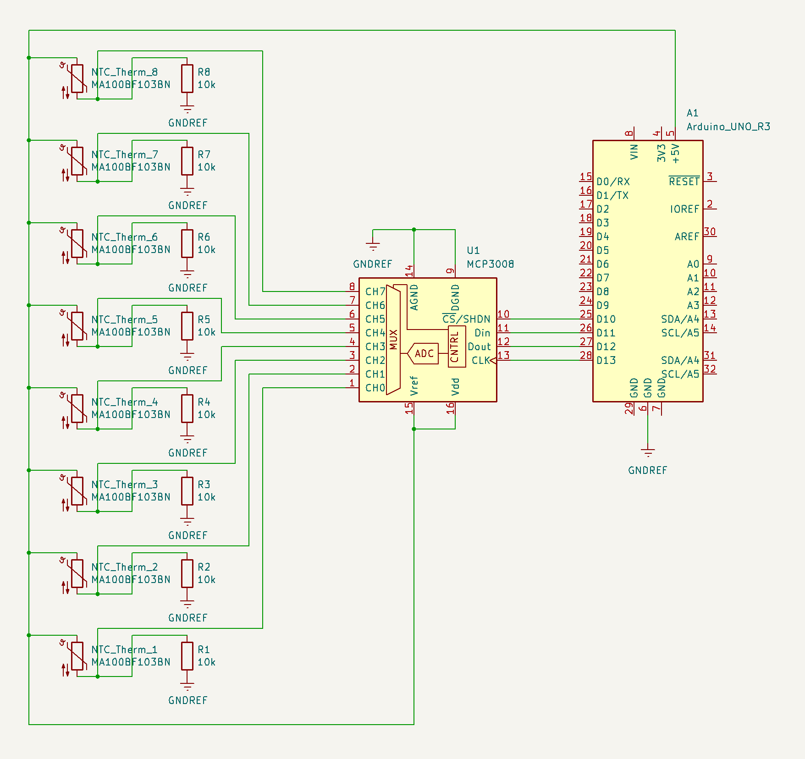
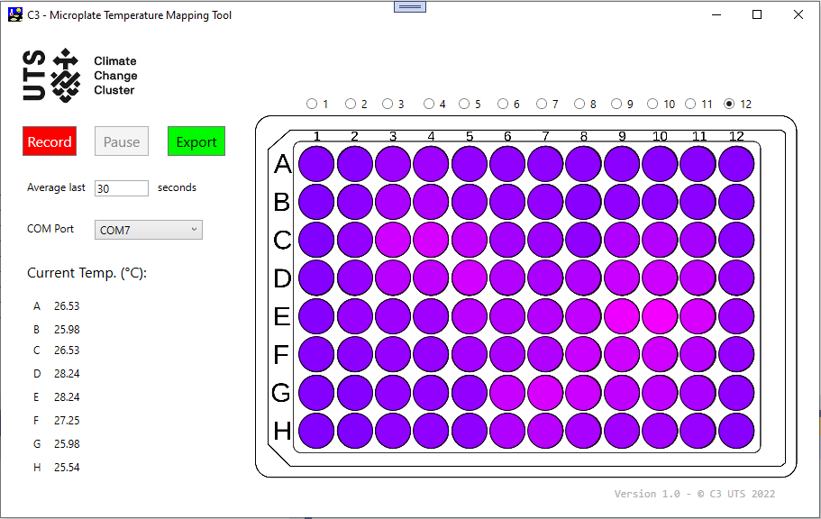

# Temperature Mapping Tool

This repository contains instructions on how to build build an 8-channel temperature probe using an Arduino UNO, an MCP3008 ADC chip and 8 x Amphenol Advanced Sensors MA100BF103BN. It also contains a desktop application written in C# to communicate with the device and convenientily store data from a 96-well microplate.

## Circuit Diagram

## Desktop App Overview

### Contributors

* @benocd
* @DrPlantabyte
* Eric Luong
